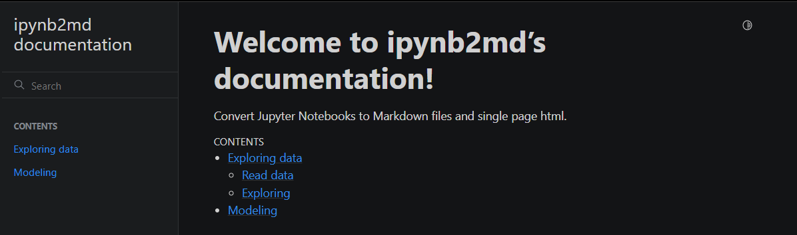

# ipynb2md

Convert Jupyter Notebooks to Markdown files and single page html.

Example documentation in `docs/index.html`.


## Installation

```
pipx install git+https://github.com/dobraga/ipynb2md --python python3.10 --include-deps
```

## Example usage

```
ipynb2md --help


usage: ipynb2md [-h] -i INPUT [-o OUTPUT] [-rc] [-k] [-v]

options:
  -h, --help            show this help message and exit
  -i INPUT, --input INPUT
                        Input path
  -o OUTPUT, --output OUTPUT
                        Output path
  -rc, --remove_code    Remove code in output file
  -k, --keep            Keep intermediary files
  -v, --verbose         Show more output in logs
```

example usage removing code output and keep intermediary files.
```sh
ipynb2md -i tests/example -rc -k -o docs/
```
